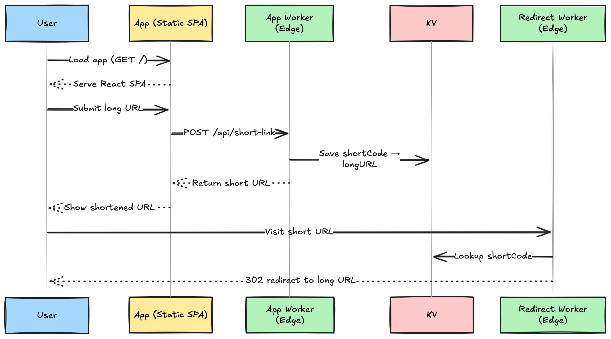

# 🔗 Cloudflare URL Shortener

A fully **serverless**, **edge-native** URL shortener built on **Cloudflare’s global infrastructure** — leveraging Workers, KV, and Pulumi to deliver blazing-fast redirection with minimal vendor lock-in.



## 📁 Monorepo Structure

```
url-shortener/
├── apps/
│   ├── web/         # Cloudflare Worker (React SPA + API routes)
│   ├── redirector/  # Cloudflare Worker (GET /\:code → reads from KV, redirects)
├── packages/
│   ├── schema/      # Shared Zod schemas for validation, enabling end-to-end type safety
│   └── ui/          # Shared component library (shadcn/ui)
├── infra/pulumi/    # IaC: DNS, KV, routing
├── .github/workflows/ # CI/CD with GitHub Actions
├── turbo.json       # Turborepo configuration

```

## 🧪 Local Development

### Prerequisites

- Node.js (see `package.json` engines field)
- pnpm (e.g., `pnpm@10.4.1` as per `packageManager`)

### Commands

```bash
# Install dependencies
pnpm install

# Start all services locally
pnpm dev
```

## 🧰 Tech Stack

| Layer         | Tech                                                    |
| ------------- | ------------------------------------------------------- |
| Frontend      | React, Vite, Tailwind CSS, `@workspace/ui` (shadcn/ui)  |
| Backend       | Cloudflare Workers (`web`, `redirector`)                |
| Validation    | Zod (`@workspace/schema`)                               |
| Storage       | Cloudflare KV (eventually consistent, edge-distributed) |
| Infra-as-Code | Pulumi (TypeScript, Cloudflare provider)                |
| DevOps        | GitHub Actions, Wrangler CLI, Turborepo                 |
| Deployment    | Cloudflare Workers, DNS, TLS                            |

## 🧩 Core Components

### 1. **App Worker** (`apps/web`)

- Single Cloudflare Worker that serves both:
  - **Frontend**: Vite-powered React SPA
  - **Backend**: API routes for URL shortening (e.g., `POST /api/short-link`)
- Replaces the previous `url-creator` Worker
- Uses `assets.not_found_handling: "single-page-application"` for SPA routing
- Hosted directly on Cloudflare Workers (not Cloudflare Pages)
- UI built with `@workspace/ui`
- Uses `@workspace/schema` for request/response validation and typing
- Designed for future backend expansion (e.g., admin, analytics)

### 2. **Redirector Worker** (`apps/redirector`)

- Cloudflare Worker at `GET https://r.${BASE_DOMAIN}/:code`
- Fetches the original URL from KV and redirects via HTTP 302
- Returns a custom 404 page for invalid or expired codes
- Optimized for ultra-low latency

### 3. **UI Component Library** (`packages/ui`)

- Tailwind + shadcn/ui-based design system
- Shared across all frontend surfaces
- Published as `@workspace/ui`

### 4. **Schema Module** (`packages/schema`)

- Centralized Zod-based schemas for validation and type inference
- Shared between frontend and backend to enforce strict contract
- Examples:

  ```ts
  // CreateShortLinkRequest
  z.object({
    originalUrl: z.string().url(),
    customCode: z
      .string()
      .min(3)
      .max(20)
      .regex(/^[a-zA-Z0-9_-]+$/)
      .optional(),
    expiresAt: z.string().datetime().optional(),
  });

  // ShortLink
  z.object({
    shortCode: z.string(),
    originalUrl: z.string().url(),
    createdAt: z.string().datetime(),
    expiresAt: z.string().datetime().optional(),
    clicks: z.number().optional(),
  });
  ```

## ⚙️ Infrastructure & Configuration

- Turborepo manages the monorepo
- Each Worker has its own `wrangler.jsonc` for:
  - Entry points
  - KV bindings
  - Asset/config settings

## 🔄 CI/CD Pipeline

- GitHub Actions for:
  - Building frontend assets
  - Deploying Workers
  - Running tests and linting
- Wrangler used for deploying Workers to Cloudflare

## 📦 Package Management

- Uses `pnpm` with workspace configuration
- Shared packages (`shared`, `ui`) managed efficiently across the repo

## 🏗️ Infrastructure

- Pulumi manages:
  - DNS
  - KV namespaces
  - Worker routes
- Cloudflare Workers handle all compute logic
- Cloudflare KV provides globally distributed, edge-accessible storage

Infrastructure bindings are abstracted to make future migrations easy.

## 🔓 Vendor Portability

| Cloudflare  | Alternative                                     |
| ----------- | ----------------------------------------------- |
| Workers     | Vercel Edge Functions, Deno Deploy, Lambda@Edge |
| KV          | Upstash, DynamoDB, EdgeDB                       |
| Pulumi (CF) | Pulumi AWS/Azure, Terraform, CDK                |

> Platform bindings are abstracted — migration won’t require core rewrites.

## 🚀 Roadmap

Curious about what’s coming next?
📍 Check out the [project roadmap](https://r.trungung.com/url-shortener-roadmap) for planned features, enhancements, and priorities.

## 📜 License

MIT © TrungUng
